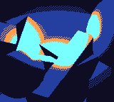
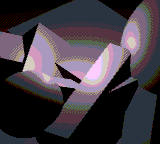
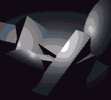
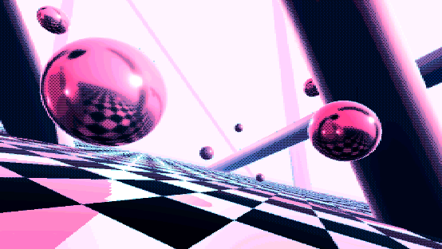

# RetroSuite3D
Some image effects and shaders to achieve a retro look in Unity.

This suite contains the following effects and shaders

* **Fixed palette:** Define any number of color and it will remap the final image to the defined colors
* **Graded palette:** Same as above but a bit more automated, lets you define gradients instead and it will fill in the blanks. You can also set the blending between each gradients. (e.g. AB <-> CD, gradients are created between A and B, and C and D, but you can also adjust a blending constant to blend B and C together, for a more consistant look)
* **Dithering:** Lets you set any dithering pattern you want, defined as a pattern image. You can adjust the strength and treshold.
* **Resolution downsampler:** Force the final resolution to a defined resolution. **NOTE: It will work great with a fixed resolution but will produce varying results with arbitrary resolutions. i.e. the pixel size won't be consistent and might look less (or more) pixelated depending on the size.** It is most likely possible to calculate some ratios to enhance the results.
* **Posterize effect:** Color quantization, nothing too fancy, quantizes linearly. Non-linear quantization would be a nice feature to achieve different looks.

Open the included scene and observe how it is setup (check the scripts attached to the camera)

  

Using reflection probes and simple shapes with checkerboards, you can achieve some serious vaporwave:

